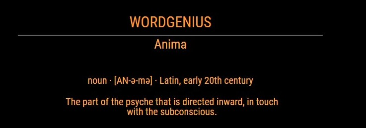

# MMM-ThisWordDoesNotExist
Magic Mirror Module to show a word from the ThisWordDoesNotExist.com website. This module does NOT require the user to enter any external API keys or secrets.

This word itself is completely generated by AI. 

This is mainly just a fun module to consider adding to your mirror. Many of the generated words are completely believable.

You may need to tweak the css styling to fit your mirror. Mine runs on a VERY low resolution, but very W I D E monitor
(a weird commercial unit), so it might look a bit off for other cases.

Enjoy the module :)


# Screenshot



# Installation
```
cd ~/MagicMirror/modules
git clone https://github.com/drventure/MMM-ThisWordDoesNotExist.git
cd MMM-ThisWordDoesNotExist
npm install
```

## Add to config:
```
module: 'MMM-ThisWordDoesNotExist',
position: 'top_right',
config: {
	updateInterval: 120000,
	headerText: "ThisWordDoesNotExist"
}
```

### Thanks To:
This module is based off of the Word of the Day module written by @jmwyds.
